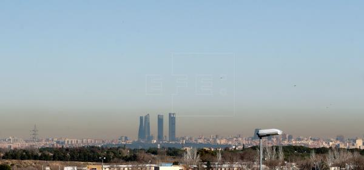

El dataset de contaminación de madrid contiene los datos de la concentración de diferentes contaminantes tomados a la hora en las distintas estaciones que se encuentran repartidas por la ciudad. 
Las estaciones de medida están repartidas por diferentes distritos y los datos han sido etiquetados para tener las mediciones localizadas y para poder hacer un estudio por distritos de los cambios en los niveles de contamición debido al periodo de cuarentena por la emergencia sanitaria del coronavirus en 2020. Además del mismo modo se ha analizado el impacto de las medidas de Madrid central.

Aunque se toman medidas de numeros elementos tóxicos, en este trabajo nos centraremos con algunos de los principales:

* DIÓXIDO DE AZUFRE 
* MONÓXIDO DE CARBONO 
* MONÓXIDO DE NITRÓGENO 
* PARTÍCULAS <2.5 micrómetros 
* ÓXIDOS DE NITRÓGENO OZONO

En las gráficas podemos encontrar valores totales medios de contaminación en un periodo de tiempo, evolución de los diferentes contaminantes por separado a lo largo de lo meses y valores medios por distrito en ciertos periodos de tiempo indicados.